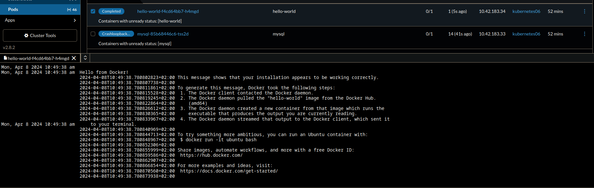

# zadanie 0
200 OK

# Zadanie 1
 - utworzyłem projekt
 - dodałem namespace nginx
 - `kubectl create deployment nginx --image=nginx --namespace=nginx`
 - `kubectl expose deployment nginx --port=8081 --namespace=nginx`


# Zadanie 2 
- Environment check na stronie Longhorna daje zielone swiatlo do instalowania Longhorna
- Dodałem Longhorna za pomoca GUI Ranchera
- 
 - W panelu zostały wprowadzone zmiany do podu nginx.
 - ~~jednak nie udalo sie bo mielismy longhorna, tylko zostal usuniety w zmiane na ranchera nie poprawnie~~
# Zadanie 3

 - dodałem repo o nazwie rodeo, kierujące do https://rancher.github.io/rodeo
 - zainstalowałem tetrisa 

# Zadanie 4
 - Zainstalowałem neuvector 
 - Zainstalowałem Extension Operator
 - zainstalowałem NeuVector UI Extension 


# Zadanie 5
 - Włączyłem autoscan w neuvectorze
 - Dodałem dockerownię 


To też sprawka pana Adriana?

ID: `08e93041fe885bdce864`

# Zadanie 6
Musimy dodać PV, ustawić tryb PVC na manualny oraz zaaplikować yaml. Oto przykładowy yaml:

```yaml
---
kind: PersistentVolume
apiVersion: v1
metadata:
  name: ubuntu-pv
spec:
  capacity:
    storage: 1Gi
  accessModes:
    - ReadWriteOnce
  persistentVolumeReclaimPolicy: Retain
  storageClassName: manual
  local:
    path: /mnt/data
---
kind: PersistentVolumeClaim
apiVersion: v1
metadata:
  name: ubuntu-pvc
spec:
  storageClassName: manual
  accessModes:
    - ReadWriteOnce
  resources:
    requests:
      storage: 1Gi
---
apiVersion: apps/v1
kind: Deployment
metadata:
  labels:
    app: ubuntu
  name: ubuntu
spec:
  replicas: 1
  selector:
    matchLabels:
      app: ubuntu
  template:
    metadata:
      labels:
        app: ubuntu
    spec:
      volumes:
        - name: test-vol
          persistentVolumeClaim:
            claimName: ubuntu-pvc
      containers:
        - name: ubuntu
          image: busybox:latest
          command:
          - sleep
          - "86400"
          volumeMounts:
            - mountPath: /shared_files
              name: test-vol
```

# Zadanie 7
Także Panie Adrianku, można podejrzeć yaml zasobu za pomocą komendy `kubectl get <resource> <nazwa> -o yaml` lub `kubectl describe <resource> <nazwa>`. Jeśli chcesz przez GUI, to w Rancherze klikasz na zasób w namespace i wyświetla ci się jego yaml.

# Zadanie 9
ReplicaSet jest prostszym mechanizmem, który zapewnia, że określona liczba replik podów jest uruchomiona w każdym momencie. Deployment oferuje więcej funkcji, takich jak aktualizacje, cofanie do poprzednich wersji i zarządzanie stanem aplikacji.

# Zadanie 12
 - Pan adrian stworzyl poda mysql i dał mu 64 megabajtów ramu. Ciekawe dlaczego jest zabijany przez oomkillera. 
 - ~~erm. dlaczego sie automatycznie usuwa klon???~~
 - Zaktualizowano deployment i dodano więcej RAMu.
 - **mysql-5788b9fcff-m6m4n**

# Zadanie 17
- Tworzymy nowy projekt oraz namespace "baza", i ładujemy .yaml.
- Dodajemy więcej ramu, aby OMMkiller sie nie uruchamiał, i zmieniamy nazwe ROOT PASSWORD env, aby serwer sie uruchomil poprawnie.
- Wszystko super chodzi 


# Zadanie 18
Pan Adrian użył złego obrazu. Nasze serwery nie są na architekturze arm64v8, tylko amd64.

