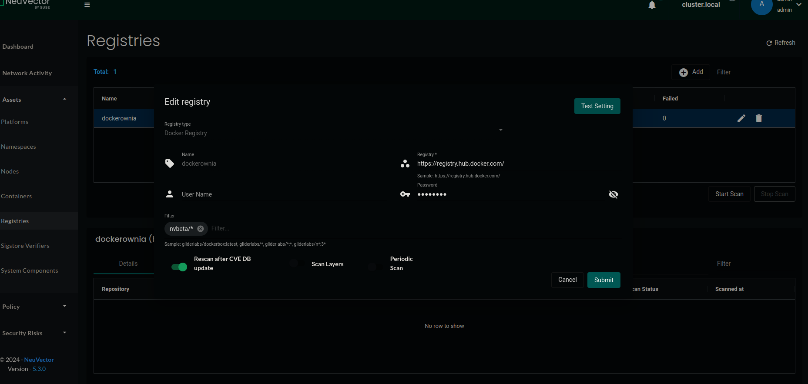

# zadanie 0
200 OK

# Zadanie 1
 - utworzyłem projekt
 - dodałem namespace nginx

# Zadanie 2 
- Environmment check zwraca brak kilku potrzebnych paczek (env check z dokumentacji Longhorn)
- Zainstalowalem potrzebne paczki oraz Longhorna za pomoca kubectl apply.
- Zauwazony blad:  	Containers with incomplete status: [wait-longhorn-manager]
- Manager crashuje sie z powodu braku open-iscsi
- Zainstalowanie dependencies za pomoca "kubectl apply -f https://raw.githubusercontent.com/longhorn/longhorn/v1.4.0/deploy/prerequisite/longhorn-iscsi-installation.yaml"
- Longhorn dziala 

# Zadanie 3
 - dodałem repo o nazwie rodeo, kierujące do https://rancher.github.io/rodeo
 - zainstalowałem tetrisa 

# Zadanie 4
 - Zainstalowałem neuvector 
 - Zainstalowałem Extension Operator
 - zainstalowałem NeuVector UI Extension 

# Zadanie 5
 - Włączyłem autoscan w neuvectorze
 - Dodałem dockerownię 

To też sprawka pana Adriana?

ID: `08e93041fe885bdce864`

# Zadanie 7
Także Panie Adrianku, można podejrzeć yaml zasobu za pomocą komendy `kubectl get <resource> <nazwa> -o yaml` lub `kubectl describe <resource> <nazwa>`. Jeśli chcesz przez GUI, to w Rancherze klikasz na zasób w namespace i wyświetla ci się jego yaml.

# Zadanie 9
ReplicaSet jest prostszym mechanizmem, który zapewnia, że określona liczba replik podów jest uruchomiona w każdym momencie. Deployment oferuje więcej funkcji, takich jak aktualizacje, cofanie do poprzednich wersji i zarządzanie stanem aplikacji.

# Zadanie 12
 - Pan adrian stworzyl poda mysql i dał mu 64 megabajtów ramu. Ciekawe dlaczego jest zabijany przez oomkillera. 
 - ~~erm. dlaczego sie automatycznie usuwa klon???~~
 - Zaktualizowano deployment i dodano więcej RAMu.
 - **mysql-5788b9fcff-m6m4n**

# Zadanie 17
- Tworzymy nowy projekt oraz namespace "baza", i ładujemy .yaml.
- Dodajemy więcej ramu, aby OMMkiller sie nie uruchamiał, i zmieniamy nazwe ROOT PASSWORD env, aby serwer sie uruchomil poprawnie.
- Wszystko super chodzi

# Zadanie 18
Pan Adrian użył złego obrazu. Nasze serwery nie są na architekturze arm64v8, tylko amd64.

